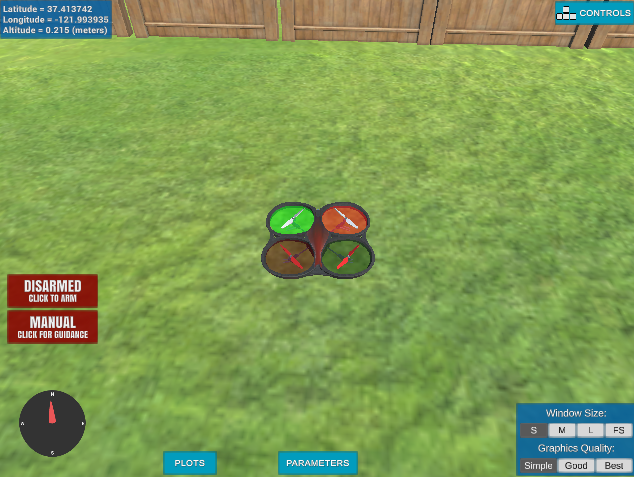
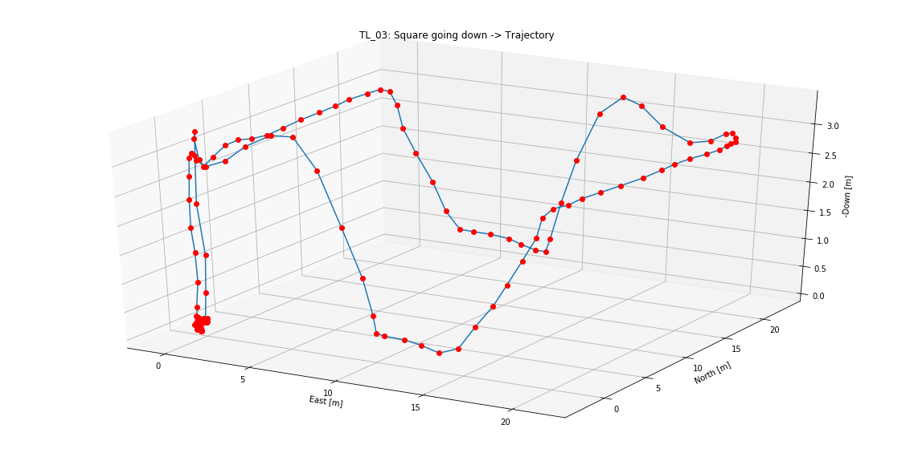
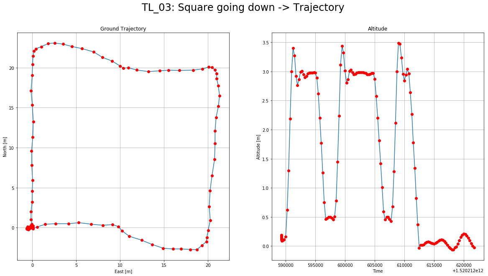
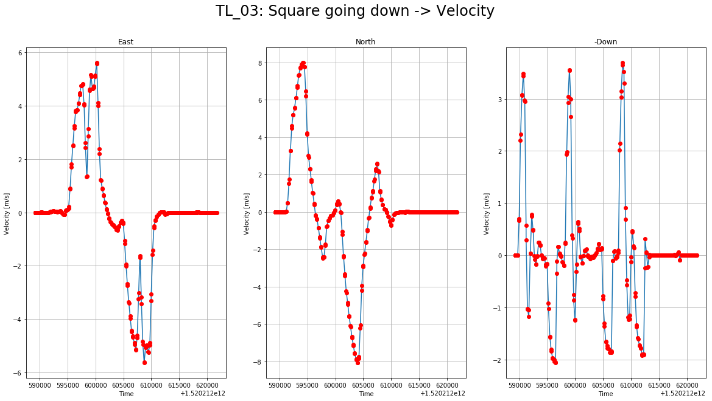

# FCND-Term1-P1-Backyard-Flyer
Udacity Flying Car Nanodegree - Term 1 - Project 1 - Backyard Flyer

This is the first project on [Udacity's Flying Car Nanodegree](https://www.udacity.com/course/flying-car-nanodegree--nd787). We need to control a simulated drone using python to fly in a square trajectory in a backyard. Udacity's FCND Simulator could be downloaded [here]((https://github.com/udacity/FCND-Simulator-Releases/releases). The python code use [Udacidrone](https://udacity.github.io/udacidrone/) API to communicate with the simulator. This API use [MAVLink](http://qgroundcontrol.org/mavlink/start) protocol.


# Prerequisites

To run this project you need to have the following software installed:

- [Miniconda](https://conda.io/miniconda.html) with Python 3.6. I had some problems while installing this on my Mac after having an older version install and some other packages install with Homebrew. I have to manually delete all the `~/*conda*` directory from my home and then install it with `bash Miniconda3-latest-MacOSX-x86_64.sh -b`.
- [Udacity FCND Simulator](https://github.com/udacity/FCND-Simulator-Releases/releases) the latest the better.

# Run the code
Just in case you don't have it, update to the latest conda version:
```
conda update -n base conda
```
At this time, the latest version is 4.4.11

Change directory to where you clone this repo. Let's call that directory REPO_PATH. Create the conda environment for this project:
```
conda env create -f environment.yml
```
**Note**: This environment configuration is provided by Udacity at [the FCND Term 1 Starter Kit repo](https://github.com/udacity/FCND-Term1-Starter-Kit).

Activate your environment with the following command:
```
source activate fcnd
```

Start the drone simulator. You will see something similar to the following image:



The code controlling the drone is `backyard_flyer.py`. You can run it with the following command:
```
python backyard_flyer.py
```

After a couple of seconds, the drone on the simulator should start moving describing a square. If you want to try other trajectories or to build your own, you can pass a "waypoints" file to the code with the following command:
```
python backyard_flyer.py --waypoint_file triangle_waypoints.csv
```
There are three waypoints files on the repo:
- `square_waypoints.csv`: The normal square trajectory.
- `square_2_waypoints.csv`: Bigger square with the drone going down to 50 cm in the middle.
- `triangle_waypoints.csv`: Kind of a triangular trajectory avoiding the fence that is in the middle of it.

You can find videos of the first two trajectories at [./videos](./videos).
On the [visualization notebook](./Visualizations/Telemetry.ipynb), there are trajectory graphs with more details about position and velocity of the drone using the telemetry information generated by the code. Here is an example of those graphs:



Details about ground position and altitude:



Details about velocity:



The `backyard_flyer.py` implements the following state machine to control the drone using an even-driven/asynchronous approach:


When the code receives following messages:
- MsgID.LOCAL_POSITION: Informing current position of the drone.
- MsgID.LOCAL_VELOCITY: Informing current velocity of the drone.
- MsgID.STATE: Informing current state of the drone.

The callbacks on those messages instruct the state changes and command the drone to take actions. This code is based on the seed project provided by Udacity [here](https://github.com/udacity/FCND-Backyard-Flyer). It provides the basic structure of the code and information about the different data structure used.

# [Project Rubric](https://review.udacity.com/#!/rubrics/1216/view)
## Mission script
### Fill in the state transition methods for Drone class: arming_transition(), takeoff_transition(), waypoint_transition(), landing_transition(), and disarming_transition() are all filled in.

The transition methods are complete ([lines 96 - 180](./backyard_flyer.py#L96)). The actual state transition was moved to the message callback to separate the actions from the state transition. Usually, it is beneficial to do so to be able to reuse the transition function elsewhere. In the case of this code, there is no reuse possible because it is simple and we are just warming up, but it could be something to use for future projects.

### Fill in the appropriate callbacks. Shell state_callback, local_position_callback, and velocity_callback are provided though they may not be required for all states.

The callbacks are complete ([lines 43 - 94](./backyard_flyer.py#L43))calling the right transition method based on the position, velocity, and state of the drone. Here again could be good to separate the "transitions guards" from the code, but I didn't go so far.

## Mission Analysis
### Running the backyard_flyer.py script correctly commands the vehicle to fly in a square.

The drone executes the path more or less correct, and it lands within 1 meter from the initial position. Especially, when a square trajectory is used.
